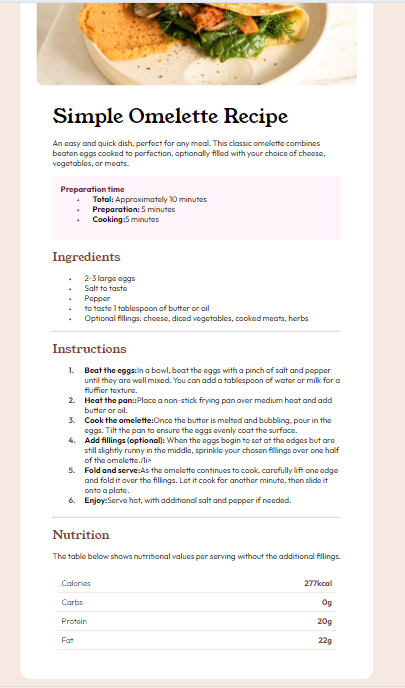

# Frontend Mentor - Recipe page solution

This is a solution to the [Recipe page challenge on Frontend Mentor](https://www.frontendmentor.io/challenges/recipe-page-KiTsR8QQKm). Frontend Mentor challenges help you improve your coding skills by building realistic projects.

## Table of contents

- [Overview](#overview)
  - [Screenshot](#screenshot)
  - [Links](#links)
- [My process](#my-process)
  - [Built with](#built-with)
  - [What I learned](#what-i-learned)
  - [Continued development](#continued-development)
  - [Useful resources](#useful-resources)
- [Author](#author)
- [Acknowledgments](#acknowledgments)

**Note: Delete this note and update the table of contents based on what sections you keep.**

## Overview

### Screenshot



### Links

- Solution URL: (https://github.com/Junbol-Frontend-Mentor/Recipe_page_HTML-CSS)
- Live Site URL: (https://junbol-frontend-mentor.github.io/Recipe_page_HTML-CSS/)

## My process

### Built with

- Semantic HTML5 markup
- CSS custom properties
- Flexbox
- Mobile-first workflow

### What I learned

```css
ul li::before {
  content: '•'; /* Bullet character */
  color: var(--color-Nutmeg); /* Color of the bullet */
  position: absolute;
  font-size: 20px; /* Larger bullet */
  font-family: 'Outfit', sans-serif;

  left: 0;
}

ol {
  counter-reset: list-counter; /* Creates a counter for ordered list */
}

ol li::before {
  counter-increment: list-counter; /* Increments the counter */
  content: counter(list-counter) '.'; /* Displays the counter */
  color: var(--color-Nutmeg); /* Color of the number */
  position: absolute;
  font-size: 16px; /* Larger number */
  font-weight: 700;
  left: 0;
  font-family: 'Outfit', sans-serif;
}

.grid-container {
  display: grid;
  grid-template-columns: 250px repeat(1, 1fr); /* with fr you have more flexibility than just using auto Creates two columns */
  grid-gap: 0; /* Remove gap to allow borders to connect */
  padding: 10px;
  font-family: 'Outfit', sans-serif;
  /* background-color: aqua; */
}

.grid-item {
  padding: 8px; /* Padding for each item */
  display: flex; /* This will align the content nicely */
  align-items: center; /* Centers items vertically within the div */
  text-align: left;
  border-bottom: 2px solid var(--color-Light_Gray);
}

.label {
  font-weight: 300; /* Optional: to highlight the label */
}

.value {
  justify-content: flex-end; /* Aligns the values to the right */
  width: 100%; /* Ensures the values take up the full width */
  color: var(--color-Nutmeg);
}
```

### Continued development

I would like to continue studying responsive CSS and animation, transitions and FX like parallax.

### Useful resources

- [web.dev](https://web.dev/learn/css) - This helped me for get back on track with CSS.
- [w3schools](https://www.w3schools.com/css/default.asp) - The one place to refresh stuff in practical way.

## Author

- Website - [Junier Bolivar](https://www.bolivarcreativedesign.com)
- Frontend Mentor - [Junbol](https://www.frontendmentor.io/profile/Junbol)
- Twitter - [@JunierBolivar](https://www.twitter.com/@JunierBolivar)

## Acknowledgments
